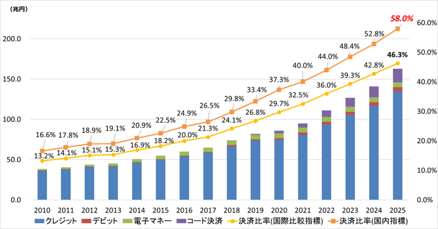
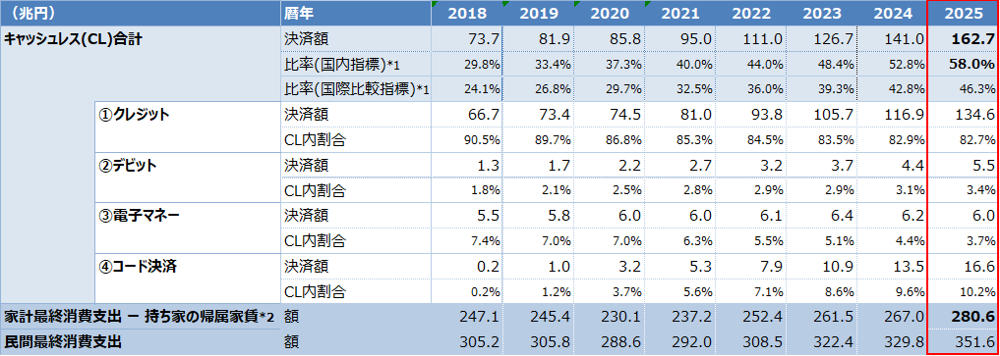
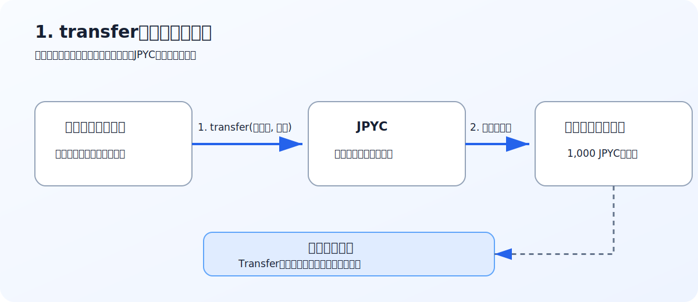
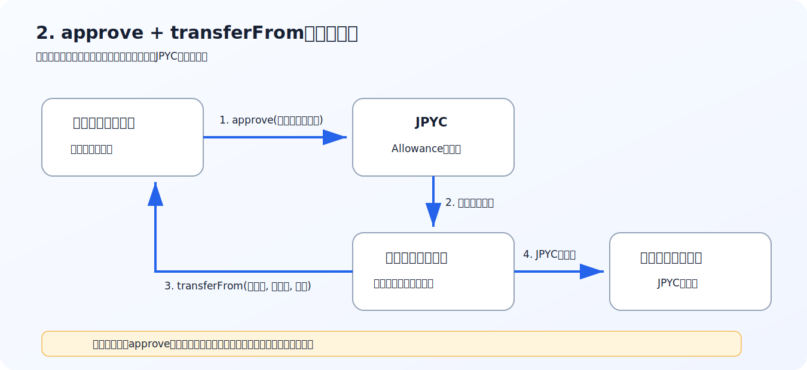
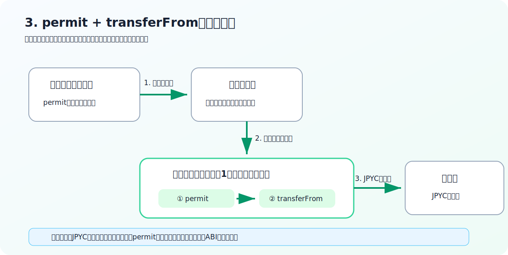
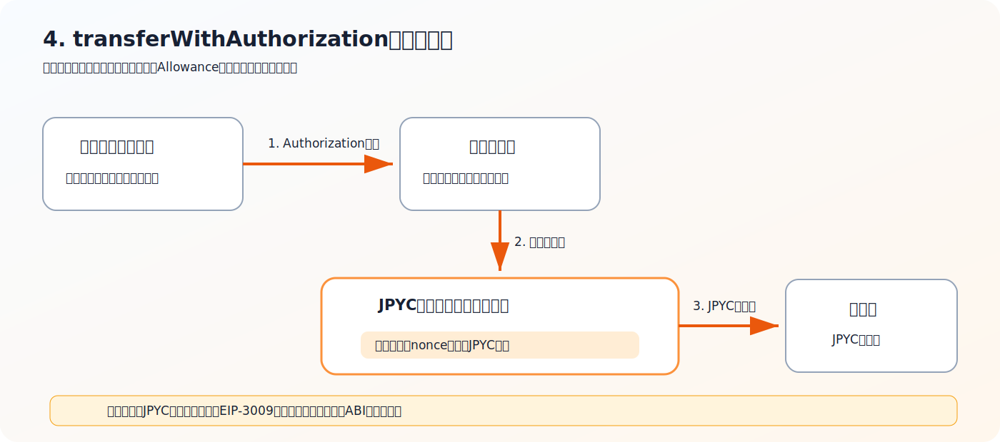
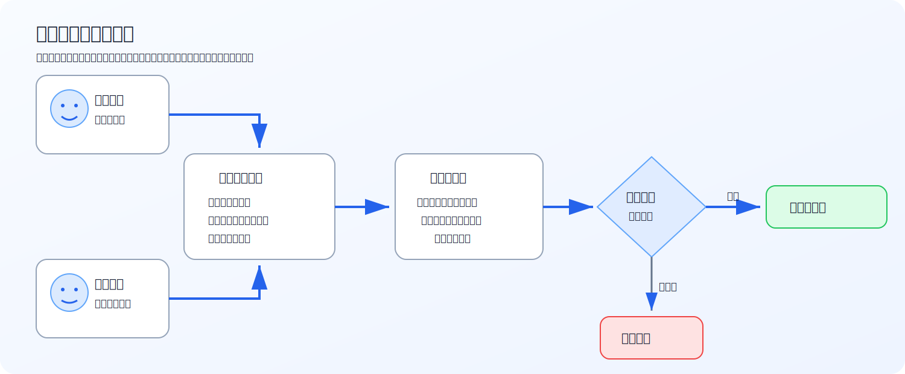
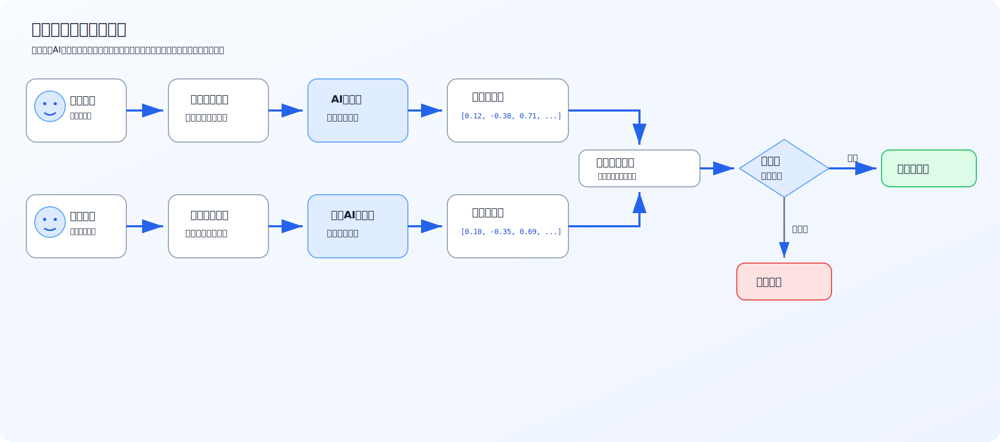
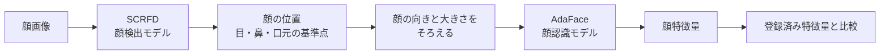

# freeiD決済におけるステーブルコイン決済導入

## 目次

- [概要](#概要)
- [この記事で作ったもの](#この記事で作ったもの)
- [背景](#背景)
- [課題](#課題)
  - [1. 加盟店手数料の支払いが発生する](#1-加盟店手数料の支払いが発生する)
  - [2. 現金払いと比べて売上代金の入金までに時間がかかる](#2-現金払いと比べて売上代金の入金までに時間がかかる)
- [課題解決アプローチ](#課題解決アプローチ)
- [技術調査](#技術調査)
  - [1. ステーブルコイン](#1-ステーブルコイン)
  - [2. 決済方式](#2-決済方式)
  - [3. 顔認証](#3-顔認証)
- [アプリ実装](#アプリ実装)
  - [1. 仕様](#1-仕様)
  - [2. api仕様](#2-api仕様)
- [アプリケーション動作デモ](#アプリケーション動作デモ)
  - [前提](#前提)
  - [決済デモ動画](#決済デモ動画)
- [アプリにおける課題](#アプリにおける課題)
  - [1. ガス代変動に対するリスク](#1-ガス代変動に対するリスク)
  - [2. 電子決済手段等取引業・電子決済等取扱業の制度に抵触する可能性](#2-電子決済手段等取引業電子決済等取扱業の制度に抵触する可能性)
  - [3. 生体情報の取り扱いと誤認証への対応](#3-生体情報の取り扱いと誤認証への対応)
- [実装した感想](#実装した感想)
- [今回作成したアプリ一覧](#今回作成したアプリ一覧)
- [参考文献](#参考文献)

## 概要

freeiD は顔認証により各種サービスを利用しやすくする顔認証プラットフォームである。サービスの中に顔認証決済サービスがある。今回は、顔認証で利用者を特定し、JPYCによるステーブルコイン決済を実行するデモアプリを作成し、キャッシュレス決済における加盟店手数料や入金サイクルの課題を解決できないか考えてみた。

## この記事で作ったもの

本記事では、店頭のカメラで利用者の顔を撮影し、登録済みの顔特徴量と照合したうえで、利用者に紐付いたウォレットから加盟店ウォレットへJPYC決済を行うデモアプリを作成した。

具体的には、以下の内容を扱う。

1. 既存のキャッシュレス決済における加盟店手数料と入金サイクルの課題
2. JPYCを使ったステーブルコイン決済方式の比較
3. 顔認証による利用者特定の方式
4. デモアプリの仕様と決済フロー
5. 実運用に向けたガス代、法規制、生体情報保護の課題

## 背景
20年前は現在ほど決済手段が多様ではなく、現金とクレジットカードが中心だった。その後、交通系電子マネーやデビットカードが広がり、現在は~PayといったQRコード決済も普及しつつある。キャッシュレス決済比率は2015年には22.5%だったが、10年で58%に拡大している。今後はさらにキャッシュレス決済比率は伸びていくと考えられる。  
以下にキャッシュレス決済比率の推移を示す[1]。

<div align="center">
  <strong>キャッシュレス決済比率推移</strong><br>
  
</div>
<br>

また、キャッシュレス決済額及び比率の内訳の推移[1]を以下に示す。

<div align="center">
  <strong>キャッシュレス決済額及び比率の内訳の推移</strong><br>
  
</div>
<br>

キャッシュレス決済における決済手段の内訳は2025年でクレジットカードが82.7%、コード決済が10.2%、電子マネーが3.7%、デビットカードが3.4%だった。近年ではコード決済の普及が拡大している。

## 課題

キャッシュレス決済を導入することで、売上管理をシステム化できる。これにより、レジ締め作業や売上データの収集、現金の銀行預け入れなどの手間が減り、ヒューマンエラーの防止にもつながる。

また、利用者は現金の持ち合わせを気にせず買い物ができるため、顧客単価の向上が見込まれる。現金を持たない外国人観光客などの利用ハードルを下げ、集客機会の損失を防ぐ効果も期待できる。

一方、クレジットカード、デビットカード、電子マネー、コード決済などのキャッシュレス決済には、加盟店側から見て次のような課題がある。

### 1. 加盟店手数料の支払いが発生する

#### 決済方法別の手数料

キャッシュレス決済を導入した加盟店は、カード会社や決済事業者、決済代行会社などに加盟店手数料を支払う。手数料率は、決済方法、契約するサービス、加盟店の業種や取引規模などによって異なる。主な目安を以下に示す[2][3][4][5]。

決済方法 | 業種 | 加盟店手数料の目安
--- | ---- | ------
クレジットカード | 家電量販店、コンビニなどの大型チェーン店 | 1～2%程度になることも
クレジットカード | デパート、百貨店 | 2～3%程度
クレジットカード | 個人経営店、小売店、専門店 | 3～5%程度
クレジットカード | 居酒屋、レストランなど飲食店 | 3～6%程度
クレジットカード | サービス業（役務提供） | 3.5～6%程度
デビットカード | 一律 | 3.25%[3]
電子マネー | - | 3～4%[4]
コード決済 | - | 2.178～3.24%[5]


#### 手数料率に差が生じる要因

クレジットカードでは、コンビニなどの大手チェーンやデパートは取引額が大きく、条件交渉によって手数料率が比較的低くなる場合がある。一方、小規模な個人経営店や飲食店は、大手事業者と比べて条件交渉が難しく、相対的に高い手数料率が適用される傾向にある。デビットカード、電子マネー、コード決済でも、契約するサービスやプランに応じた手数料が発生するため、複数の決済方法に対応する加盟店では、キャッシュレス決済全体の利用額に応じて継続的な費用負担が生じる。

#### 影響を受けやすい事業者

2025年時点で利用可能な最新の全産業横断統計である「令和3年経済センサス‐活動調査」に基づき、国内の主要業種別の個人企業数と個人企業比率を以下に示す[6]。個人企業比率は、各産業の企業等数に占める個人企業数の割合として算出した。
主要業種（産業大分類） | 個人企業数<br>（個人企業比率） | 代表的な中・小分類 | 個人企業数
---- | -------- | --------- | ---------
卸売業、小売業 | 322,543<br>（43.5%） | 飲食料品小売業<br>機械器具小売業<br>織物・衣服・身の回り品小売業 | 112,382<br>46,064<br>32,514
宿泊業、飲食サービス業 | 332,215<br>（77.9%） | 飲食店 | 308,079
生活関連サービス業、娯楽業 | 267,140<br>（79.8%） | 洗濯・理容・美容・浴場業 | 240,451
医療、福祉 | 155,061<br>（51.9%） | 療術業<br>一般診療所<br>歯科診療所 | 62,615<br>36,799<br>49,462
建設業 | 110,728<br>（26.0%） | 職別工事業（設備工事業を除く）<br>総合工事業<br>設備工事業 | 49,436<br>38,968<br>22,312
不動産業、物品賃貸業 | 103,930<br>（31.7%） | 不動産賃貸業・管理業 | 95,666
製造業 | 96,525<br>（28.4%） | 繊維工業<br>金属製品製造業<br>食料品製造業 | 13,457<br>12,947<br>9,372
学術研究、専門・技術サービス業 | 96,595<br>（45.0%） | 公認会計士事務所<br>公証人役場、司法書士事務所<br>法律事務所、特許事務所 | 2,411<br>10,233<br>11,544
教育、学習支援業 | 75,683<br>（69.4%） | 教養・技能教授業<br>学習塾 | 47,371<br>27,165

加盟店手数料が比較的高いとされる業種と、個人企業の多い業種には重なりが見られる。該当する業種（卸売業・小売業、宿泊業・飲食サービス業、生活関連サービス業・娯楽業）の個人企業数は、合計で約92万社に上る。特に、宿泊業・飲食サービス業の個人企業比率は77.9%、生活関連サービス業・娯楽業では79.8%であり、いずれも約80%を占めている。

加盟店手数料は、一般に加盟店が負担する。加えて、クレジットカードでは、加盟店規約により利用者への手数料の上乗せが認められていない場合がある。このため、大手事業者と比べて取引額が少なく、決済事業者との条件交渉も難しい小規模事業者にとって、キャッシュレス決済に伴う手数料は利益を圧迫する継続的な負担となる。

#### モデルケースによる手数料試算

決済手数料の負担を業種横断で比較するため、年間売上5,000万円、キャッシュレス決済比率58%の事業者をモデルケースとする。この場合、年間のキャッシュレス決済額は2,900万円となる。これを2025年の決済方法別構成比で配分し、それぞれに前述の最小・最大手数料率を適用した試算を以下に示す[1]。

決済方法 | 構成比 | 年間決済額 | 手数料率 | 年間手数料
---- | ---- | ---- | ---- | ----
クレジットカード | 82.7% | 約2,398万円 | 3～6% | 約71.9万～143.9万円
コード決済 | 10.2% | 約296万円 | 2.178～3.24% | 約6.4万～9.6万円
電子マネー | 3.7% | 約107万円 | 3～4% | 約3.2万～4.3万円
デビットカード | 3.4% | 約99万円 | 3.25% | 約3.2万円
**合計** | **100%** | **2,900万円** | - | **約84.8万～161.0万円**

#### 試算から分かること

決済額の規模によらず比較できるよう換算すると、キャッシュレス決済額1,000万円当たりの加盟店手数料は約29.3万～55.5万円となる。年間売上5,000万円のモデルケースでは、年間の加盟店手数料は最小の場合でも約84.8万円、最大の場合には約161.0万円となり、月額では約7.1万～13.4万円に相当する。

特に、クレジットカードはキャッシュレス決済額の82.7%を占め、手数料率にも幅があるため、契約条件によって総負担額が大きく変動する。小売業、宿泊・飲食サービス業、生活関連サービス業など、加盟店手数料が比較的高く、個人企業が多い業種では、この継続的な費用が利益を圧迫する要因となる。

2026年現在、物価高騰などを背景に、キャッシュレス決済の廃止を選択した事例も報告されている[7]。


### 2. 現金払いと比べて売上代金の入金までに時間がかかる

#### 入金までの流れ

キャッシュレス決済では、利用者が支払いを行っても、売上代金が直ちに事業者の銀行口座へ入金されるとは限らない。クレジットカード、デビットカード、電子マネー、コード決済のいずれも、一般に決済事業者や決済代行会社を介して売上代金が精算される。

入金サイクルは決済方法や契約内容によって異なり、翌営業日に入金されるサービスがある一方、締め日までの売上が月1回または数回にまとめて入金される場合もある。

#### 資金繰りへの影響

特に、日々の売上を仕入れ費や人件費などの運転資金に充てる小規模事業者にとっては、入金までの期間が長いほど手元資金が不足しやすくなる。このように、短期間での資金回収を必要とする事業者にとって、キャッシュレス決済の入金サイクルは資金繰り上の負担となる場合がある。  

## 課題解決アプローチ

本記事では、キャッシュレス決済における加盟店手数料や入金サイクルの課題に対し、ステーブルコインを活用した顔認証決済を提案する。

ステーブルコインは、ブロックチェーン上で移転できるデジタル資産であり、従来の決済手段と比べて低コストかつ短時間で送金できる可能性がある。特に、日本円に連動するステーブルコインを利用すれば、加盟店は日本円建ての金額感を維持したまま、決済手数料の低減や売上代金の早期回収を期待できる。

一方、ステーブルコイン決済では、利用者がスマートフォンでQRコードを読み取り、ウォレットアプリ上で送金操作を行う方式が一般的に考えられる。しかし、この方式ではウォレットの操作や送金内容の確認が必要となり、ITに詳しくない利用者にとっては心理的・操作的な負担が大きい。

そこで本記事で作成するアプリでは、ウォレット登録時に利用者が事前に決済利用範囲へ署名し、店頭での決済時は顔認証だけで決済できる仕組みを目指す。顔認証によって登録済みの利用者を特定し、その利用者に紐付けられたウォレット情報と事前に登録された利用許可をもとにステーブルコイン決済を実行することで、低コストな決済と使いやすさの両立を図る。

想定する処理の流れは以下のとおりである。

1. 店頭のカメラで利用者の顔を撮影する
2. 顔認証によって登録済みの利用者を特定する
3. 利用者に紐付けられたウォレット情報を取得する
4. 決済金額を確認し、ステーブルコインの送金処理を実行する
5. ブロックチェーン上の処理結果を確認し、決済を完了する


## 技術調査
ステーブルコインによる顔認証決済のアプリを実現するため、技術調査、選定を行った。

### 1. ステーブルコイン

ステーブルコインとは、法定通貨などの特定資産を参照し、その資産に対して価格が安定するよう設計されたデジタル資産である。例えば日本円連動型であれば、原則として1コインが1円程度の価値を維持するように設計される。ビットコインなどの暗号資産と同様にブロックチェーン上で移転できる一方、価格変動を抑える仕組みを備えているため、送金や決済への利用に適している。

ただし、ステーブルコインは法定通貨そのものではない。価格の安定性は、発行者が保有する準備資産、利用者による発行・償還、裁定取引などによって支えられる。そのため、「常に価格が固定されている」ことが保証されるわけではなく、発行者の信用や準備資産の管理状況も重要となる。

#### ステーブルコインの主な種類

ステーブルコインは、価値を安定させる仕組みによって次のように分類できる。

種類 | 価格を安定させる仕組み | 主な特徴・リスク
---- | ---- | ----
法定通貨担保型 | 発行額に対応する現金や預金、短期国債などを発行者が準備資産として保有する | 仕組みが比較的分かりやすく、決済に利用しやすい。一方、発行者や準備資産の管理を信頼する必要がある
暗号資産担保型 | 暗号資産をスマートコントラクトに預け入れ、通常は担保価値を上回らない範囲で発行する | ブロックチェーン上で仕組みを確認しやすいが、担保価格の急落時には強制清算が発生する
アルゴリズム型 | 供給量の増減や関連トークンとの交換によって価格を調整する | 十分な裏付け資産を持たない場合があり、市場の信頼が失われると価格維持の仕組みが機能しない可能性がある

#### 現在発行・流通している主なステーブルコイン

2026年6月時点で発行・流通している代表的なステーブルコインを以下に示す。

名称 | 主に参照する通貨 | 分類 | 発行・運営主体 | 流通供給量（概算） | 概要
---- | ---- | ---- | ---- | ---- | ----
USDT | 米ドル | 法定通貨担保型 | Tether[8] | 約1,864億USDT | 米ドルとの1対1の連動を目指し、Tetherの準備資産によって裏付けられる
USDC | 米ドル | 法定通貨担保型 | Circle[9] | 約748億USDC | 米ドルへ1対1で償還できるよう設計され、現金や現金同等資産などを準備資産として保有する
PYUSD | 米ドル | 法定通貨担保型 | Paxos Trust Company、PayPal[10] | 約27.4億PYUSD | 米ドル預金、米国債、現金同等資産などによって裏付けられる
EURC | ユーロ | 法定通貨担保型 | Circle[11] | 約3.81億EURC | ユーロへ1対1で償還できるよう設計されたユーロ連動型ステーブルコイン
JPYC | 日本円 | 法定通貨担保型 | JPYC株式会社[12] | 現行版の比較可能な値を確認できず | 1JPYCを1円として扱う日本円連動型ステーブルコイン
DAI・USDS | 米ドル | 暗号資産等の担保を利用するプロトコル型 | Sky Protocol[13] | DAI：約42.7億、USDS：約103.3億 | スマートコントラクトと複数の担保資産を利用して、米ドルに連動する価値の維持を目指す

同じ名称のトークンでも、複数のブロックチェーン上で発行されている場合や、第三者が別のチェーンへ移した派生版が存在する場合がある。実際に利用する際は、発行主体、対応するブロックチェーン、正式なコントラクトアドレスを確認する必要がある。

流通供給量は、CoinGeckoの市場データAPIが集計した2026年6月22日21時51分（日本時間）時点の値を四捨五入した概算である[14]。発行・償還や集計方法によって常に変動するため、厳密な最新発行残高は各発行主体の公式情報で確認する必要がある。なお、同APIで取得できるJPYCは旧JPYC v1として登録されており、現行JPYCの値として扱えないため掲載していない。

#### ステーブルコインの主な特徴

- **価格の安定を目指している**：法定通貨などの価格を参照することで、一般的な暗号資産よりも価格変動を抑えるよう設計されている。
- **ブロックチェーン上で移転できる**：銀行の営業時間に直接依存せず、対応するネットワーク上で送金できる。
- **プログラムから扱える**：一定の条件を満たした場合に送金するなど、スマートコントラクトを利用した処理へ組み込める。
- **国や地域をまたいで利用できる可能性がある**：同じブロックチェーンへ接続できれば送金できるが、実際の利用可否は各国の法令やサービスの対応範囲に左右される。

#### 採用するステーブルコイン

本アプリは日本国内で利用されるサービスを想定しているため、日本円に連動するJPYCを採用する。利用者から加盟店への支払いにはJPYCを使用し、日本円を基準とした金額で決済を行う。

### 2. 決済方式

JPYC決済の基本は、利用者が保有するJPYCを加盟店へ移すことである。現金払いで利用者が店舗へ現金を渡すことに相当するが、JPYCではブロックチェーン上のプログラムに送金内容を記録する。クレジットカードのようにカード会社が後日まとめて店舗へ入金する仕組みとは異なり、送金が承認されると加盟店はブロックチェーン上でJPYCを受け取る。

ただし、これは「JPYCを受け取る」までの話であり、加盟店の銀行口座へ日本円として入金されることとは別である。加盟店が日本円で資金化する場合は、JPYCの償還や外部サービスを通じた入金処理が必要となる。そのため、入金サイクルの課題を評価する際は、ブロックチェーン上でのJPYC受領までの時間と、日本円として銀行口座へ着金するまでの時間を分けて考える必要がある。

ただし、JPYCを移すための操作方法は一つではない。本記事では、代表的な4方式を「誰が送金処理を実行するか」と「誰がガス代を負担するか」という観点で比較する。先に、説明で使用する用語を整理する。

##### はじめに押さえる用語

用語 | 初心者向けの説明
---- | ----
ウォレット | JPYCそのものを保存する箱ではなく、JPYCを操作するための秘密鍵を管理するアプリケーション。銀行アプリに近い役割を持つ
ウォレットアドレス | JPYCの送金先を示す文字列。銀行振込における口座番号に相当する
秘密鍵 | ウォレットの所有者だけが持つ重要な情報。外部へ公開してはいけない
署名 | 秘密鍵を公開せずに、「このウォレットの所有者が操作を承認した」と証明するデータ。印鑑や暗証番号による承認に近い
トークンコントラクト | JPYCの残高や送金ルールを管理するブロックチェーン上のプログラム
決済コントラクト | 注文の確認や二重決済の防止など、店舗決済の処理を行うブロックチェーン上のプログラム
トランザクション | ブロックチェーンへ送信する処理要求。送金などの結果がブロックチェーン上に記録される
トランザクションハッシュ | 各トランザクションに付けられる固有の識別番号。銀行振込の受付番号に近く、送金状況の確認に使う
オンチェーン | 処理をブロックチェーンへ送信し、結果を記録すること。通常はガス代が発生する
オフチェーン | ブロックチェーンへ記録せず、利用者の端末やサーバー内で処理すること。署名の作成自体には通常ガス代がかからない
ガス代 | ブロックチェーン上で処理を実行するためのネットワーク手数料。JPYCとは別の通貨で支払う場合がある
リレイヤー | 利用者の署名を受け取り、利用者の代わりにトランザクションを送信するサーバー。リレイヤーがガス代を負担すれば、利用者はガス代用通貨を準備せずに済む
Allowance | 決済コントラクトなどに対して、「自分のJPYCをこの金額まで移してよい」と設定した利用可能額
nonce（ナンス） | 同じ署名が2回使用されることを防ぐための、一度限りの識別値
ABI | ブロックチェーン上のコントラクトにどの機能があるかを示す仕様書。利用したい決済機能への対応確認に使う

##### 4方式に共通する決済の流れ

どの方式でも、店舗決済の大きな流れは同じである。

1. 店舗が商品金額と送金先を提示する。
2. 利用者が送金または送金許可の内容を確認する。
3. ウォレットの所有者が操作を承認したことを署名によって証明する。
4. 利用者またはリレイヤーがトランザクションを送信する。
5. JPYCのトークンコントラクトが署名や残高を確認し、JPYCを加盟店へ移す。
6. freeiDの決済システムが送金結果を注文情報と照合し、決済完了と判定する。

4方式の違いは、主に上記3と4をどのように実行するかにある。

ここで出てくる`transfer`、`approve`、`permit`などは、利用者が画面に入力する言葉ではない。JPYCのようなトークンコントラクトが持っている内部機能名である。実際のアプリ画面では、「送金する」「利用を許可する」「署名する」のような表示になる。

方式 | 何をしているか | 利用者がすること | ガス代を払う人 | 向いている用途
---- | ---- | ---- | ---- | ----
`transfer` | 利用者のウォレットから店舗のウォレットへ直接送る | 送金を承認する | 利用者 | 単発の送金、簡単な支払い
`approve` + `transferFrom` | 利用者が先に「この金額まで引き落としてよい」と許可し、あとで決済システムが引き落とす | 利用許可のトランザクションを承認する | 利用許可は利用者、決済実行は実行者 | 繰り返し使う店舗決済
`permit` + `transferFrom` | 利用者が「この金額まで引き落としてよい」と署名し、決済システムがその署名を使って許可を登録してから引き落とす | ガス代なしで署名する | 許可登録と決済実行は加盟店またはリレイヤー | 利用者のガス代負担をなくしたい店舗決済
`transferWithAuthorization` | 利用者が「今回だけ、この相手にこの金額を送ってよい」と署名し、実行者が送金する | ガス代なしで署名する | 加盟店またはリレイヤー | 1回限りの支払い

要するに、`approve`と`permit`はどちらも「あとで決済システムが引き落とせるようにする」方式である。違いは、`approve`では利用者がトランザクションを送ってガス代を払うのに対し、`permit`では利用者は署名だけを行い、ガス代を決済システム側で負担できる点である。

##### 1. `transfer`による直接送金

`transfer`は、利用者が自分のウォレットから加盟店へ直接JPYCを送る、最も単純な方式である。一般的な銀行振込に近く、送金先と金額を指定して利用者自身が送金を実行する。

<div align="center">
  
</div>
<br>

```text
利用者ウォレット
    │ transfer(加盟店アドレス, 1,000 JPYC)
    ▼
加盟店ウォレット
```

**メリット**：1回の送金で完了し、決済コントラクトや事前の利用許可が不要なため、仕組みが最も単純である。

**デメリット**：利用者がガス代用通貨を用意する必要がある。また、送金にfreeiDの注文番号を直接含められないため、同額の注文が重なる場合は、注文ごとに受取アドレスを分けるなどの照合方法が必要となる。

##### 2. `approve`と`transferFrom`による決済

この方式は、銀行口座からの口座振替に近い。利用者は最初に`approve`を使い、「この決済コントラクトは、自分のJPYCを指定額まで移してよい」と許可する。その後、決済コントラクトが`transferFrom`を実行し、許可された範囲内で利用者から加盟店へJPYCを移す。

<div align="center">
  
</div>
<br>

```text
利用者
    │ 1. approve(決済コントラクト, 利用上限額)
    ▼
決済コントラクト
    │ 2. transferFrom(利用者, 加盟店, 決済金額)
    ▼
加盟店
```

**メリット**：一度Allowanceを設定すれば、その範囲内では次回以降の利用許可を省略できる。注文番号の記録や二重決済の防止なども実装しやすい。

**デメリット**：初回は`approve`と決済の2回のオンチェーン操作が必要となる。また、利用許可が残るため、無制限の金額を許可すると、決済コントラクトに問題が発生した場合の被害が大きくなる。

##### 3. `permit`と`transferFrom`による決済

`permit`は、`approve`で行っていた利用許可を、ガス代のかからない署名に置き換える方式である。利用者は「この決済コントラクトに、指定額までの利用を許可する」という内容へ署名する。加盟店またはリレイヤーがその署名をブロックチェーンへ送り、続けて`transferFrom`でJPYCを加盟店へ移す。

<div align="center">
  
</div>
<br>

```text
利用者
    │ 1. permit用データへ署名（オフチェーン）
    ▼
加盟店またはリレイヤー
    │ 2. permit(署名、金額、有効期限)
    │ 3. transferFrom(利用者, 加盟店, 決済金額)
    ▼
加盟店
```

**メリット**：利用者はガス代のかからない署名だけで利用許可を出せる。`permit`と`transferFrom`を一つのトランザクションにまとめれば、利用許可と支払いを同時に処理できる。

**デメリット**：`permit`だけでは送金されないため、`transferFrom`も必要となる。nonce、有効期限、Allowanceを安全に管理しなければならない。

##### 4. `transferWithAuthorization`による決済

`transferWithAuthorization`は、「今回の1回の支払い内容」へ利用者が署名する方式である。利用者は送金先、金額、有効期限などを確認して署名し、加盟店またはリレイヤーがその署名を使ってJPYCを移す。`permit`が利用上限を設定してから別の機能で送金するのに対し、この方式は署名の確認と送金を`transferWithAuthorization`だけで実行する。

<div align="center">
  
</div>
<br>

```text
利用者
    │ 1. 送金内容へ署名（オフチェーン）
    ▼
加盟店またはリレイヤー
    │ 2. transferWithAuthorization(
    │      利用者, 加盟店, 金額,
    │      validAfter, validBefore, nonce, 署名
    │    )
    ▼
加盟店
```

**メリット**：署名の確認とJPYCの移転を一つの処理で実行でき、Allowanceが残らない。送金先、金額、有効期限を署名時に固定できるため、1回限りの決済として管理しやすい。

**デメリット**：決済のたびに新しい署名が必要なため、継続課金には向かない。また、対象JPYCがEIP-3009に対応している必要があり、署名の有効期限、nonce、第三者による送信への対策も必要となる[15]。

#### 採用する決済方式

本アプリでは、`permit`と`transferFrom`を組み合わせた決済方式を採用する。利用者はウォレット登録時に、オフチェーンで決済利用範囲に対する利用許可へ署名する。店頭での決済時は、顔認証によって利用者を特定したうえで、加盟店またはリレイヤーが事前に登録された利用許可の範囲内で送金処理を実行する。これにより、利用者は決済のたびにスマートフォンで署名操作を行わず、ガス代も負担せずに決済できる。加盟店が運営する各店舗で共通の決済コントラクトを利用することで、店舗ごとに異なる操作を必要とせず、どの店舗でも同じ手順で決済できる構成とする。

### 3. 顔認証
#### 1. 画像比較型

画像比較型は、登録時に撮影した顔画像と、認証時に撮影した顔画像を画像データのまま比較する方式である。顔の位置や大きさをそろえた後、画素ごとの差分、明るさ、輪郭、目・鼻・口の位置関係などを基に類似度を算出し、設定した閾値以上であれば同一人物と判定する。

<div align="center">
  
</div>
<br>

**メリット**：処理内容を理解しやすく、比較的単純な画像処理でも実装できる。撮影条件を一定にしやすい環境での簡易な本人確認や、顔認証の試作に適している。

**デメリット**：撮影時の照明、顔の向き、表情、カメラとの距離、眼鏡やマスクの有無などによって画像の見え方が変わるため、認証精度が撮影環境に左右されやすい。特に、不特定多数がさまざまな条件で利用する決済サービスでは、環境変化への耐性が課題となる。また、登録画像そのものを保存する場合、漏えい時に利用者の顔を直接確認できてしまうため、暗号化、アクセス制御、保存期間の制限などを適切に行う必要がある。

#### 2. 特徴量比較型

特徴量比較型は、顔画像をそのまま比較するのではなく、AIモデルによって顔の特徴を数値の並びである「特徴量」に変換し、その特徴量同士を比較する方式である。この数値の並びは特徴ベクトルまたは埋め込みベクトルと呼ばれ、同一人物の顔から生成された特徴量は近く、別人の特徴量は離れるようにモデルが設計・学習されている。

<div align="center">
  
</div>
<br>

**メリット**：適切に学習されたモデルを使用することで、画像比較型よりも照明、顔の向き、表情などの変化に対応しやすい。また、登録者が指定した本人であるかを確認する1対1認証だけでなく、撮影した人物が登録者のうち誰であるかを検索する1対多認証にも利用できる。freeiDのように、顔を提示して利用者を特定するサービスでは、登録済みの特徴量から候補者を検索し、その後に閾値を用いて本人かどうかを判定する構成が考えられる。

**デメリット**：認証精度は使用するAIモデル、登録画像の品質、閾値の設定に依存する。閾値を緩くすると他人を本人と判定する可能性が高まり、厳しくすると本人を拒否する可能性が高まるため、決済用途で求める安全性と利便性を考慮して調整する必要がある。また、特徴量から元の顔画像を完全に復元できない場合でも、特徴量は個人を識別するための重要な情報であり、漏えいしてもパスワードのように変更できない。したがって、暗号化、アクセス制御、通信経路の保護、不要データの削除などが必要である。

両方式の違いを以下に示す。

比較項目 | 画像比較型 | 特徴量比較型
---- | ---- | ----
比較するデータ | 補正した顔画像や画像上の情報 | AIモデルが生成した特徴量
撮影環境の変化 | 影響を受けやすい | 適切なモデルを使用すれば比較的影響を抑えやすい
実装の複雑さ | 比較的単純 | モデルの選定、推論処理、閾値の評価が必要
多数の登録者からの検索 | 大規模化すると画像比較の負荷が高い | 特徴量検索を利用して高速化しやすい
保存データの注意点 | 顔画像そのものが漏えいするリスクがある | 特徴量も個人識別に用いる重要情報として保護が必要
主な用途 | 撮影条件を固定できる簡易認証、試作 | 実運用の本人認証、多数の登録者からの検索

#### 採用する顔認証方式

本アプリでは、多数の登録者の中から対象者を短時間で特定できるようにするため、特徴量比較型を採用する。登録時に顔画像から特徴量を生成して保存し、認証時に生成した特徴量と比較することで、登録済みの利用者を検索する。

## アプリ実装
### 1. 仕様
#### 1. permit(決済利用範囲登録)とtransferFrom(実決済)の分離
今回のコンセプトは顔認証を使用することにより簡単に決済を行えるシステムの実現である。決済を行うたびに利用者に決済範囲の登録を強いる場合、利便性が失われてしまう。そこで、今回作成するアプリではウォレット登録時に1度permit作業を行ってもらい、決済時は顔認証するだけにすることで、利用者の負荷を下げる。

ただし、顔認証だけで利用者資産を移転できる状態にすると、誤認証や不正利用が発生した場合の影響が大きくなる。そのため、実運用ではpermitの上限額、有効期限、1回あたりの決済上限、日次・月次上限、利用者による許可取消方法を明確に設計する必要がある。また、決済前の金額提示、利用者同意の記録、誤認証時の取消・返金手順、補償方針を整備し、顔認証の利便性と資産移転の安全性を両立させる必要がある。

#### 2. ガス代のリレイヤー負担
ガス代はJPYCではなく、選択したネットワーク上で利用できるトークンで支払う必要がある。そのため、利用者や加盟店の負担にすると、JPYCとは別にガス代用のトークンを取得・管理しなければならず、導入時の障害になることが想定される。

そこで、本アプリではリレイヤーがガス代を負担する構成とする。利用者はJPYCを用意すれば決済でき、加盟店もガス代用トークンの管理を意識せずに利用できるため、ステーブルコイン決済の導入ハードルを下げられる。リレイヤー側の費用回収方法としては、加盟店から月額利用料を受け取るサブスクリプションモデルが考えられる。Polygonネットワークでは、2026年5月28日時点のJPYC送金例として、1回あたりのガス代が0.000737106 POL、円換算で約0.01円とされている[16]。そのため、低コストなネットワークを選択すれば、取引量や月額料金の設計次第で、サブスクリプションモデルでも事業として成立する可能性がある。

サブスクリプションモデルの参考として、飲食店1店舗を想定した試算を行う。ここでは、前述の年間売上5,000万円のモデルケースを飲食店1店舗に当てはめ、キャッシュレス決済比率58%を用いる[1]。この場合、月間売上は約417万円、月間キャッシュレス決済額は約242万円となる。飲食店では業態によって客単価が大きく異なるため、客単価別に月間キャッシュレス決済件数を逆算すると以下のようになる。なお、2025年の外食産業市場動向調査でも、業態別に客数・客単価が継続的に集計されており、飲食店の収益性を見るうえで客単価は重要な指標である[17]。

Polygon上のJPYC送金1回あたりのガス代を0.000737106 POL、約0.01円として計算すると、リレイヤーが負担するガス代は以下のようになる[16]。

客単価 | 月間キャッシュレス決済額 | 月間決済件数 | 月間ガス代（POL） | 月間ガス代（円換算） | 年間ガス代（円換算）
---- | ---- | ---- | ---- | ---- | ----
1,000円 | 約242万円 | 約2,417件 | 約1.78 POL | 約24円 | 約290円
2,000円 | 約242万円 | 約1,208件 | 約0.89 POL | 約12円 | 約145円
3,000円 | 約242万円 | 約806件 | 約0.59 POL | 約8円 | 約97円

計算式は、月間決済件数を「月間キャッシュレス決済額 ÷ 客単価」で求め、その件数に0.000737106 POLまたは0.01円を掛ける。例えば客単価1,000円の場合、約2,417件 × 0.000737106 POL = 約1.78 POL、円換算では約24円となる。

月額2万円の利用料を設定した場合、上記の飲食店モデルでは、Polygonネットワークの送金例を前提にすると、月間ガス代は多くても数十円程度に収まる。仮にガス代が10倍の0.1円まで上昇しても、客単価1,000円のケースで月約242円であり、ガス代だけを見れば月額利用料の中で十分に吸収できる水準である。ただし、ガス代は低いが固定ではなく、POL価格とネットワーク混雑により変動するため、月間無料件数の上限、従量課金、ガス代急騰時の価格改定条項を設ける必要がある。また、実運用ではサーバー費用、人件費、監視・保守費用、決済失敗時の再送費用も発生するため、ガス代以外の運用費も含めて料金設計を行うことが望ましい。

JPYCが対応する主なネットワークには、Ethereum、Polygon、Avalancheがある[18]。リレイヤーがガス代を負担する構成では、利用者の使いやすさだけでなく、事業者側のガス代変動リスク、対応サービスの多さ、決済確定までの時間も考慮してネットワークを選定する必要がある。

ネットワーク | ガス代用通貨 | 特徴 | リレイヤー負担の観点
---- | ---- | ---- | ----
Ethereum | ETH | 対応サービスが最も多く、DeFiやNFTなど外部サービスとの接続性が高い。一方、ガス代は比較的高く、混雑時に上昇しやすい。 | 少額・高頻度決済ではリレイヤー負担が大きくなりやすいため、店舗決済の標準ネットワークとしては慎重な検討が必要。
Polygon | POL | Ethereum互換で、低コストかつ高速処理に向いている。参照記事ではPolygonのガス代用通貨がMATICと記載されているが、現在の本記事ではPOL表記に統一する。 | 顔認証決済のような高頻度・少額決済では、ガス代を月額料金内で吸収しやすく、リレイヤー負担方式と相性がよい。
Avalanche | AVAX | 取引確定が速く、ガス代も比較的低い。DeFi用途では一定の利用があるが、対応サービス数はEthereumやPolygonより少ない傾向にある。 | 低コスト・高速という点では有力だが、利用したいウォレット、取引所、周辺サービスの対応状況を確認する必要がある。

以上を踏まえると、本アプリのように店頭で多数の少額決済を処理する用途では、ガス代と確定時間の観点からPolygonを第一候補とする。ただし、将来的に外部サービス連携を重視する場合はEthereum、Avalancheエコシステム上のサービス連携を重視する場合はAvalancheも選択肢となる。  

今回は学習用にJPYC送金可能なブロックチェーンネットワークの中のPolygon, Avalanche, Ethereumを選択可能な仕様とする。

#### 3. 顔認証

本アプリでは、顔を見つけるモデルとしてSCRFD、顔を識別するための特徴量を作るモデルとしてAdaFaceを使用する。SCRFDは顔検出モデルであり、画像の中から顔の位置と目・鼻・口元などの基準点を推定する。AdaFaceは顔認識モデルであり、顔画像を「同じ人なら近く、別人なら離れやすい」顔特徴量に変換する。



SCRFDは、画像内のさまざまな大きさの顔を検出するためのモデルである。顔全体の位置だけでなく、目・鼻・口元のような顔の基準点も推定できるため、検出後に顔の向きや大きさをそろえやすい。顔が写っていない場合や複数人の顔が写っている場合は、認証対象を1人に定められないため失敗として扱う。

AdaFaceは、顔画像から本人確認に使う顔特徴量を作るモデルである。一般的な顔認識モデルは、同じ人物の特徴量を近づけ、別人物の特徴量を遠ざけるように学習する。AdaFaceはそれに加えて、画像の品質も考慮する点に特徴がある。明るさ、ぼけ、顔の向きなどによって顔画像の品質が下がると、無理に強い判定をしないよう調整しながら特徴量を作る。

登録時は、AdaFaceで作成した顔特徴量をユーザーIDと紐づけて保存する。認証時は、撮影画像から同じ方法で顔特徴量を作成し、保存済みの特徴量の中から最も近いものを探す。十分に近い特徴量が見つかった場合のみ、登録済みの利用者として扱う。

### 2. api仕様
各APIのシーケンス図については[各種APIシークエンス図](https://github.com/terao06/teraid-pay-api/tree/main/docs/sequences)にて定義。

## アプリケーション動作デモ
### 前提
デモ実行前に以下の手順で事前にデータ作成を行った。
* デモ用ユーザー(user_id=104)とデモ用加盟店(store_id=104)を作成
* デモ用ユーザー、デモ用加盟店それぞれに異なるウォレットをそれぞれ登録

### 決済デモ動画
<div style="max-width: 800px; margin: 0 auto; aspect-ratio: 16 / 9;">
  <iframe
    src="https://www.youtube.com/embed/4sE_cq7BI2w"
    title="決済デモ動画"
    style="width: 100%; height: 100%; border: 0;"
    allow="accelerometer; autoplay; clipboard-write; encrypted-media; gyroscope; picture-in-picture; web-share"
    allowfullscreen>
  </iframe>
</div>

## アプリにおける課題
### 1. ガス代変動に対するリスク

JPYCで決済を行う場合でも、ブロックチェーン上で取引を実行するためのガス代は、JPYCとは別のトークンで支払う必要がある。例えばPolygonではPOL、EthereumではETH、AvalancheではAVAXがガス代用通貨となる。

これらのガス代用トークンは、JPYCのように日本円と連動するステーブルコインではなく、ビットコインなどと同様に価格が市場で変動する暗号資産に分類される。そのため、ネットワーク混雑によるガス代の上昇に加えて、ガス代用トークン自体の価格変動によって、円換算した運用コストが大きく変動するリスクがある。

本アプリではリレイヤーがガス代を負担する構成を想定しているため、この変動リスクは主にサービス提供者側が負うことになる。したがって、月間無料件数の上限、従量課金、ガス代急騰時の価格改定条項などを設け、ガス代の変動を料金設計に反映できる仕組みが必要である。

また、ガス代の変動分を従量課金や価格改定として加盟店へ転嫁する場合、ガス代が高騰したタイミングでは加盟店が負担する手数料も増加する。その結果、利用状況や市場環境によっては、クレジットカードやQRコード決済など既存のキャッシュレス決済手段よりも、実質的な決済手数料が高くなる可能性がある。

### 2. 電子決済手段等取引業・電子決済等取扱業の制度に抵触する可能性

JPYCは、資金移動業型の電子決済手段として扱われる日本円連動型ステーブルコインである。そのため、JPYCを用いた決済サービスを提供する場合、サービス内容によっては、電子決済手段等取引業や電子決済等取扱業に該当する可能性がある。

特に、アプリ側がJPYCの売買、交換、償還、利用者資産の管理、送金指図の仲介などに深く関与する場合、単なる決済画面や認証機能の提供にとどまらず、登録や規制対応が必要な業務と判断されるリスクがある。金融庁も、電子決済手段等取引業者は登録が必要であり、利用者は登録事業者かどうかを確認する必要があるとしている。

本アプリのデモ実装では、リレイヤーが利用者の署名をもとに送金処理を実行する構成を前提としている。この構成は学習用の実装として決済フローを理解しやすい一方、実運用ではリレイヤーの秘密鍵管理、送金処理の責任分界、規制対応をサービス提供者側で整理する必要がある。

そのため、実運用時の代替案・発展案としては、本アプリ単独でJPYCの発行・償還・交換・管理を行うのではなく、JPYCを取り扱う外部サービスとAPI連携し、規制対応や送金実行に関わる領域を外部サービス側に担ってもらう構成が有効である。アプリ側は、顔認証、加盟店管理、決済要求の作成、決済結果の確認といった利用体験の部分に役割を限定することで、制度上のリスクを抑えられる可能性がある。

この方向性の候補として、アステリア株式会社が提供する「JPYC Gateway」がある。同サービスはJPYCの企業向け入出金管理サービスであり、標準装備としてAPI/CSV連携を備え、Direct ConnectionではREST APIにより自社システムからGatewayの連携口へ直接接続できると説明されている[19][20]。また、標準プランでは基本使用料98,000円/月、送金手数料8円/件、初期費用無料とされている[19]。本アプリがJPYC GatewayのREST APIを利用できれば、アプリ単独でリレイヤー秘密鍵や送金処理を抱える構成よりも、法規制対応やガス代変動リスクを外部サービスの仕様に寄せて整理しやすくなる可能性がある。

一方で、JPYC Gatewayを利用する場合は、前述のガス代だけでなく、月額利用料と送金手数料を料金設計に含める必要がある。標準プランを前提に、飲食店1店舗あたり月額2万円の利用料で提供する場合、月額コストは以下の式で表せる。

```text
月額コスト = 98,000円 + 8円 × 月間送金件数
```

前述の飲食店モデルに当てはめると、客単価別の採算性は以下のようになる。

客単価 | 1店舗あたり月間決済件数 | 1店舗あたり送金手数料 | 月額利用料 | 1店舗あたり粗利 | 損益分岐に必要な店舗数
---- | ---- | ---- | ---- | ---- | ----
1,000円 | 約2,417件 | 約19,336円 | 20,000円 | 約664円 | 約148店舗
2,000円 | 約1,208件 | 約9,664円 | 20,000円 | 約10,336円 | 約10店舗
3,000円 | 約806件 | 約6,448円 | 20,000円 | 約13,552円 | 約8店舗

月額2万円の固定料金では、客単価1,000円の場合でも送金手数料を上回るが、1店舗あたりの粗利は約664円にとどまり、JPYC Gatewayの基本使用料98,000円を回収するには約148店舗が必要となる。客単価2,000円以上であれば、必要店舗数は10店舗前後まで下がる。

上記の試算を踏まえると、月額利用料を20,000円に設定した場合でも、客単価1,000円の店舗で送金手数料を上回る粗利を確保できる。仮に全キャッシュレス決済を本システムにリプレースできた場合、前述の概算である年間約84.8万～161.0万円の加盟店手数料が年間24.0万円に置き換わるため、導入企業の負担を減らせる可能性がある。しかし、新しい決済手法であり、まだ普及していないため、導入直後から既存のキャッシュレス決済をすべて置き換えられるとは限らない。現実的には、当初は既存決済手段と併用される可能性が高く、その場合は導入企業にとって年間24.0万円の固定費が追加されるだけになる公算が大きい。

したがって、外部サービスを利用する構成は制度上のリスク低減に有効である一方、導入初期には既存決済手段からの置き換え率が採算性を大きく左右する。実運用では、加盟店数を増やして基本使用料を分散することに加え、月間無料件数の上限、従量課金、客単価や決済件数に応じた料金プラン、導入初期の割引などを設ける必要がある。

### 3. 生体情報の取り扱いと誤認証への対応

顔認証決済では、利用者の顔特徴量を本人識別に利用するため、生体情報の取り扱いに関する設計が重要となる。顔特徴量はパスワードのように簡単に変更できないため、漏えい時の影響が大きい。

#### 同意取得、保存期間、削除要求への対応

実運用では、顔特徴量を取得する前に、利用目的、保存する情報、保存期間、第三者提供の有無、削除方法を利用者に明示し、明確な同意を取得する必要がある。また、利用者がサービスを退会した場合や顔認証決済の利用を停止した場合に、登録済みの顔特徴量を削除できる手順を用意する必要がある。

保存時には、顔特徴量や本人確認に関わる情報を暗号化し、アクセスできる管理者やシステムを最小限に絞ることが求められる。加えて、登録、照合、削除、管理者による閲覧や変更などの操作について監査ログを残し、不正アクセスや内部不正を追跡できる状態にする必要がある。

#### なりすまし対策と誤認証時の取消・返金

また、写真や動画によるなりすましを防ぐため、ライブネス検知などの対策も検討する必要がある。顔認証の判定では、他人を本人と判定する誤受入と、本人を拒否する誤拒否の両方が起こり得る。特に決済用途では、誤受入時の被害が直接的な金銭移転につながるため、閾値設定、追加認証、決済上限、異常検知、取消・返金フローを組み合わせてリスクを下げる必要がある。

例えば、高額決済や通常と異なる店舗・時間帯での決済では、顔認証だけで完了させず、スマートフォン通知やPIN入力などの追加確認を求める設計が考えられる。また、誤認証が疑われる決済については、取引履歴から対象決済を特定し、加盟店、利用者、サービス提供者の間で取消・返金を行う運用ルールを事前に定めておく必要がある。

## 実装した感想

今回は、ニュースで取り上げられているキャッシュレス決済の課題を、ステーブルコインと顔認証を組み合わせることで解決できないかという視点から考察した。

近年は、JPYCの発行開始やJPYC Gatewayのような企業向けサービスの登場など、日本国内でもステーブルコインを実際の決済や入出金管理に活用しようとする動きが進んでいる。また、金融庁も決済高度化に関する取り組みを進めており、ブロックチェーンをはじめとする新しい技術の活用は今後さらに注目されていくと考えられる。

一方で、調査を進める中で、現在の議論は制度設計や技術的な枠組みに関するものが中心であり、実際に利用者がどのような体験で決済を行うのかという観点は、まだ十分に議論されていないように感じた。

ステーブルコイン決済を普及させるためには、低コストであることだけでなく、利用者が迷わず、ストレスなく使えることも重要である。ウォレット操作や送金内容の確認に不慣れな利用者にとって、毎回スマートフォンを操作して決済する方式は負担になり得る。

その点で、顔認証を決済UIに組み込むことは、利用者の操作負担を下げる有効な選択肢になり得ると感じた。もちろん、法規制、本人確認、誤認証時の対応、加盟店側の費用負担など、実運用に向けた課題は多い。それでも、ステーブルコイン決済を日常的な店舗決済として使いやすくするための一つの方向性として、顔認証との組み合わせには十分な可能性があると考えている。

## 今回作成したアプリ一覧
[顔認証決済 API](https://github.com/terao06/teraid-pay-api)  
[ユーザー側ウォレット登録画面](https://github.com/terao06/teraid-pay-user)  
[加盟店側ウォレット登録画面](https://github.com/terao06/teraid-pay-admin)  
[決済画面](https://github.com/terao06/teraid-pay-web)  

## 参考文献

1. 経済産業省, *2025年のキャッシュレス決済比率を算出しました*, 2026年3月31日.
   https://www.meti.go.jp/press/2025/03/20260331006/20260331006.html

2. ROBOT PAYMENT, *クレジットカード決済の手数料とは？相場や仕組みを解説*.
   https://www.robotpayment.co.jp/blog/creditcard/4214/

3. JCB, *JCB加盟店のお申し込みについて*.
   https://www.jcb.co.jp/merchant/new-comer/flow/index.html

4. スマレジ, *電子マネー決済の手数料とは？導入メリットや選び方も解説*.
   https://smaregi.jp/payment/learn/emoney_commission.php

5. スマレジ, *QRコード決済の手数料とは？導入メリットや選び方も解説*.
   https://smaregi.jp/payment/learn/qr_commission.php

6. 総務省統計局, *令和3年経済センサス‐活動調査*.
   https://www.stat.go.jp/data/e-census/2021/kekka/index.html

7. TOKYO MX, *物価高でキャッシュレス決済をやめる店も*, 2026年3月13日.
   https://s.mxtv.jp/tokyomxplus/mx/article/202603130650/detail/

8. Tether, *Transparency*.
   https://tether.to/en/transparency/

9. Circle, *USDC*.
   https://www.circle.com/usdc

10. PayPal, *PayPal USD (PYUSD)*.
    https://www.paypal.com/us/digital-wallet/manage-money/crypto/pyusd

11. Circle, *EURC*.
    https://www.circle.com/eurc

12. JPYC株式会社, *JPYC株式会社公式サイト*.
    https://jpyc.co.jp/

13. Sky, *Sky Developer Documentation*.
    https://developers.sky.money/

14. CoinGecko, *Coins Markets API*.
    https://api.coingecko.com/api/v3/coins/markets?vs_currency=usd&ids=tether,usd-coin,paypal-usd,euro-coin,jpyc,dai,usds&order=market_cap_desc&per_page=20&page=1&sparkline=false

15. Ethereum Improvement Proposals, *EIP-3009: Transfer With Authorization*.
    https://eips.ethereum.org/EIPS/eip-3009

16. Myforex, *PolygonのJPYC送金手数料に関するニュース*, 2026年5月28日.
    https://myforex.com/ja/news/myf26052801.html

17. 日本フードサービス協会, *外食産業市場動向調査 2025年年間結果*.
    https://www.jfnet.or.jp/wp/wp-content/uploads/2026/01/data_c_y25-1.xls

18. SOICO, *JPYCとは？特徴や購入方法、対応チェーンなどを解説*.
    https://www.soico.jp/no1/news/cryptocurrency/19931

19. アステリア株式会社, *アステリア、JPYC Gatewayを提供開始*, 2026年2月27日.
    https://jp.asteria.com/news/2026022727936/

20. JPYC Gateway, *JPYC Gateway公式サイト*.
    https://jpycgateway.com/
